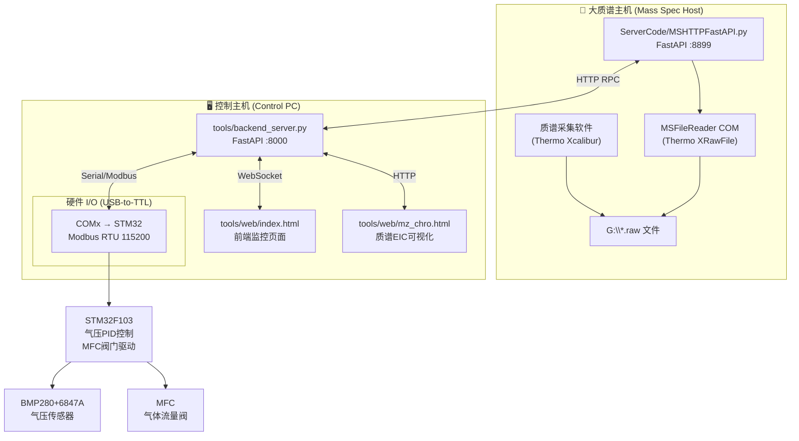

# 质谱数据实时传输与参数控制框架

本系统用于质谱实验中对**气压的闭环控制**，并与质谱仪器的数据采集同步，实现实时、远程操作和监控。

---

## 系统架构



## 功能概述

| 功能 | 说明 |
|------|------|
| **气压 PID 闭环控制** | STM32 单片机通过 BMP280+6847A 传感器读取气压，PID 算法计算后驱动 MFC 阀门调节流量；上位机可远程设定目标值、PID 参数及控制模式 |
| **质谱数据远程读写** | 通过 FastAPI RPC 代理，远程调用 Thermo MSFileReader COM 库读取 `.raw` 文件中的质谱图、提取离子流图（EIC）、谱图计数等信息 |
| **实时数据监控** | WebSocket 推送实时气压、MFC 开度等数据到前端图表展示 |
| **质谱-气压关联日志** | 一键记录当前气压与对应质谱采集时间，生成 CSV 日志 |
| **富集检测模式** | 一键设定富集目标气压与时长，计时结束后自动将目标气压设置为 100000 Pa |
| **实时质谱图** | 独立图窗实时显示 TIC（m/z 50-500）与可自定义的 EIC 曲线，定时增量刷新质谱数据 |
| **质谱数据保存** | 曲线数据（TIC/EIC）自动保存为 CSV；可选按间隔保存原始谱图快照（m/z-强度） |
| **远程文件浏览器** | 前端通过 HTTP 代理浏览大质谱主机上的 `.raw` 文件目录（文件访问白名单机制） |
| **EIC 可视化** | 独立页面可绘制指定 m/z 范围的提取离子流图（EIC） |

---

## 目录结构

```
backend/
├── ServerCode/                     # 大质谱主机端代码
│   ├── MSHTTPFastAPI.py           #   FastAPI 服务，端口 8899，代理 MSFileReader COM
│   ├── MSFileReaderLib.py         #   Thermo MSFileReader COM 的 Python 封装
│   ├── config.json                #   文件系统白名单配置
│   └── readme.txt                 #   简要说明
│
├── tools/                          # 控制主机端代码
│   ├── backend_server.py          #   后端主服务，FastAPI，端口 8000
│   ├── modbus_host.py             #   STM32 Modbus RTU 客户端（气压读取/PID配置）
│   ├── pc_pressure_controller.py  #   PC 端气压闭环控制示例（独立脚本，旧版）
│   ├── MFC.py                     #   MFC 通讯协议函数集
│   ├── logger_config.py           #   统一日志配置（控制台+文件，按天轮转）
│   ├── config.json                #   控制参数配置（串口、PID 等）
│   ├── start_backend.txt          #   启动命令备忘
│   ├── __init__.py                #   包初始化
│   ├── data_visualization.ipynb   #   数据可视化 Jupyter Notebook
│   └── web/                       #   前端页面
│       ├── index.html             #     主页面：气压PID控制监控
│       └── mz_chro.html           #     质谱EIC可视化页面
│
├── modbus/                         # Modbus 协议模块
│   ├── MFC.py                     #   MFC 相关（备用）
│   └── modbus.ipynb               #   Modbus 调试 Notebook
│
├── data/                           # 数据输出目录
│   └── pressure_*.csv             #   气压历史数据
│   └── ms_log.csv                 #   质谱关联日志
│
├── logs/                           # 日志文件目录（按天轮转，保留 30 天）
│
└── stm32_HAL_project_new/         # STM32 MCU 固件（Keil 项目，已加入 .gitignore）
    ├── Core/                      #   HAL 库生成代码（main, adc, spi, i2c, tim, usart...）
    ├── Module_Drivers/            #   外设驱动（BMP280, PID, MFC, OLED, 步进电机...）
    ├── Drivers/                   #   STM32 HAL 库
    └── MDK-ARM/                   #   Keil MDK 工程文件
```

---

## 快速开始

### 环境要求

| 组件 | 要求 |
|------|------|
| **大质谱主机** | Windows，安装 Thermo Xcalibur / MSFileReader |
| **控制主机** | Windows / Linux，Python 3.10+ |
| **硬件** | USB-to-TTL 模块连接 STM32 MCU |

### 1. Python 依赖安装

```bash
pip install fastapi uvicorn[standard] pyserial pydantic
```

### 2. 大质谱主机 — 启动 MS 数据服务

在大质谱主机上：

```powershell
cd ServerCode
python MSHTTPFastAPI.py
```

服务将在 `http://0.0.0.0:8899` 监听。

> ⚠️ 需要编辑 `ServerCode/config.json`，设置 `.raw` 文件的根目录白名单：
> ```json
> {
>   "allowed_roots": ["G:\\", "D:\\", "C:\\"]
> }
> ```

### 3. 控制主机 — 启动后端服务

在控制主机上：

```powershell
uvicorn tools.backend_server:app --reload --host 0.0.0.0 --port 8000
```

或者直接运行（从 `tools/start_backend.txt` 中复制的命令）。

### 4. 打开前端页面

在浏览器中打开：
- **主控页面**：`http://localhost:8000/web/index.html` 或 `http://<控制主机IP>:8000/web/index.html`
- **EIC 可视化**：`http://localhost:8000/web/mz_chro.html`

### 5. 配置文件

编辑 `tools/config.json` 调整参数：

```json
{
  "pressure": {
    "stm32": { "addr": 1, "baudrate": 115200 },
    "pid": {
      "kp": 0.00005,
      "ki": 0.00000078,
      "kd": 0.000003,
      "max_i": 5000.0,
      "out_min": 0.0,
      "out_max": 1.0
    },
    "period": 0.1,
    "history_window": 60.0
  }
}
```

---

## API 接口一览

### 后端服务 (`tools/backend_server.py` @ :8000)

| 方法 | 路由 | 说明 |
|------|------|------|
| `GET` | `/api/ports` | 获取可用串口列表 |
| `GET` | `/api/state` | 获取全局状态 |
| `POST` | `/api/open-stm32` | 打开 STM32 Modbus 串口 |
| `POST` | `/api/close-stm32` | 关闭 STM32 串口 |
| `POST` | `/api/target` | 设置目标气压 (Pa) |
| `POST` | `/api/enrichment/start` | 一键开启富集检测（目标气压 + 时长） |
| `POST` | `/api/enrichment/stop` | 手动取消富集检测 |
| `POST` | `/api/pid` | 设置 PID 参数并写入 STM32 |
| `POST` | `/api/reload-pid` | 从配置文件重载 PID 并写入 STM32 |
| `POST` | `/api/period` | 设置采样/控制周期 (s) |
| `POST` | `/api/history-window` | 设置历史数据窗口 (s) |
| `POST` | `/api/start` | 启动气压控制 (start_pid=1) |
| `POST` | `/api/stop` | 停止气压控制 (start_pid=0) |
| `POST` | `/api/monitor-on` | 仅监测模式 |
| `POST` | `/api/monitor-off` | 切换为控制模式 |
| `POST` | `/api/save-data` | 保存气压历史数据到 CSV |
| `POST` | `/api/ms-open` | 打开远程 .raw 文件 |
| `POST` | `/api/ms-close` | 关闭远程 .raw 文件 |
| `POST` | `/api/ms-log` | 刷新质谱并写入关联日志 |
| `POST` | `/api/ms-refresh` | 刷新远程文件视图 |
| `POST` | `/api/ms-fs-roots` | 获取远程文件系统根目录 |
| `POST` | `/api/ms-fs-list` | 列出远程目录内容 |
| `POST` | `/api/ms-chro` | 获取质谱 EIC 数据 |
| `POST` | `/api/ms-chro-lite` | 轻量版 EIC 数据获取 |
| `POST` | `/api/ms/curves-append` | 追加保存增量 TIC/EIC 曲线数据到 CSV |
| `POST` | `/api/ms/spectrum-snapshot` | 保存最新一张谱图的 m/z-强度数据到 CSV |
| `WS` | `/ws/pressure` | WebSocket 实时数据推送 |

### MS 数据服务 (`ServerCode/MSHTTPFastAPI.py` @ :8899)

该服务将 Thermo MSFileReader COM 的所有方法暴露为 HTTP JSON-RPC 接口。

| 路由 | 说明 |
|------|------|
| `GET/POST /` | 获取文件信息 (文件名, 起始时间, 结束时间) |
| `GET/POST /{func}` | 通用函数调用 (如 `Open`, `Close`, `GetEndTime`, 等) |
| `GET/POST /api/fs/roots` | 文件系统根目录 |
| `POST /api/fs/list` | 文件系统目录浏览 |
| `POST /api/ms-chro-lite` | 获取 EIC 数据（内置校验） |

调用示例：

```json
POST /Open
{
  "argsNames": [],
  "args": ["G:\\data\\sample.raw"]
}
```

---

## 数据流说明

1. **气压控制流**：前端设置目标值 → `backend_server` 通过 Modbus 写入 STM32 → STM32 内部 PID 算法计算 → 驱动 MFC 阀门 → BMP280（环境气压）+ 6847A（腔体压差）双传感器读取反馈气压 → 前端 WebSocket 实时展示
2. **质谱数据流**：前端选择 `.raw` 文件 → `backend_server` 代理 HTTP 请求到 MS 主机 → MS 主机调用 COM 库读取数据 → 返回时间/强度数组 → 前端绘图
3. **日志记录流**：点击"刷新质谱并写入日志" → 获取当前质谱时间 → 将时间、气压等信息写入 `data/ms_log.csv`

---

## STM32 气压控制单片机

STM32 固件（`stm32_HAL_project_new/`，由 Keil MDK 编译）实现以下核心功能：

- **双传感器气压测量**：
  - **BMP280**（SPI 接口）：测量当前环境大气压，作为气压计算的参考基准
  - **6847A**（模拟输出，经 STM32 ADC 采集）：测量离子源腔体内外压差
  - **实际气压 = 环境气压 (BMP280) + 腔体压差 (6847A)**
- **执行器驱动**：MFC 气体质量流量控制器
- **PID 控制**：闭环气压 PID 算法（在 MCU 上独立运行，周期 100 ms），通过对实际气压的反馈实现对 MFC 阀门开度的闭环调节
- **Modbus RTU 从站**：通过 UART1 与上位机通信（115200-8-N-1）
- **人机交互**：OLED 显示、LED 指示
- **外设**：步进电机驱动、ADC、I2C 等

### Modbus 寄存器映射（STM32 从站地址 0x01）

| 寄存器地址 | 说明 | 类型 |
|-----------|------|------|
| `0x0000~0x0001` | 滤波气压 (Pa) — BMP280 环境气压 + 6847A 压差经滤波后的值 | float32 |
| `0x0002~0x0003` | 原始气压 (Pa) — BMP280 环境气压 + 6847A 压差实时值 | uint32 |
| `0x0010~0x0011` | 目标气压 (Pa) | uint32 (R/W) |
| `0x0020` | 控制更新触发 | uint16 |
| `0x0021` | PID 启停 (0=检测, 1=控制) | uint16 (R/W) |
| `0x0030~0x0031` | MFC 开度指令 | float32 |
| `0x0100~0x0101` | PID Kp | float32 (R/W) |
| `0x0102~0x0103` | PID Ki | float32 (R/W) |
| `0x0104~0x0105` | PID Kd | float32 (R/W) |
| `0x0106~0x0107` | PID Max Integral | float32 (R/W) |
| `0x0108~0x0109` | PID Out Min | float32 (R/W) |
| `0x010A~0x010B` | PID Out Max | float32 (R/W) |

---

## 日志系统

日志通过 `tools/logger_config.py` 统一管理：

- **输出目标**：控制台 + 文件（`logs/` 目录）
- **轮转策略**：按天轮转（`TimedRotatingFileHandler`），保留最近 30 天
- **日志格式**：`[时间] [级别] [模块名] 消息内容`
- **级别控制**：通过环境变量 `LOG_LEVEL` 覆盖（默认 `DEBUG`）

```powershell
$env:LOG_LEVEL="INFO"
uvicorn tools.backend_server:app --host 0.0.0.0 --port 8000
```

---

## 前端功能说明

### 主页 (`index.html`)

- **串口管理**：刷新/打开/关闭 STM32 串口
- **气压 PID 控制**：设定目标气压、PID 参数、采样周期
- **模式切换**：仅监测模式 / PID 控制模式
- **富集检测模式**：一键设定富集目标气压与时长，实时显示倒计时，结束后自动将目标气压设为 100000 Pa
- **质谱操作**：浏览大质谱主机上的 `.raw` 文件（带文件浏览器弹窗）、打开/关闭/刷新
- **实时图表**：
  - 滤波气压曲线 + 目标气压虚线 + MFC 开度曲线（Chart.js 双 Y 轴）
- **数据保存**：气压历史数据一键保存为 CSV
- **实时质谱图**：TIC（m/z 50-500）与 EIC 分属独立图窗；EIC 支持添加/移除任意 m/z 范围曲线，每 5 秒增量刷新
- **质谱数据保存**：TIC/EIC 曲线数据自动追加保存到 `data/ms_curves_*.csv`（长表格式：time_min, series, intensity）；可选开启"保存原始谱图快照"，按设定间隔（1/5/10/30 分钟）把最新谱图的完整 m/z-强度保存到 `data/ms_spectra_*.csv`

### EIC 页面 (`mz_chro.html`)

- 输入多个 m/z 范围，实时绘制提取离子流图（EIC）
- 支持自定义起始/结束时间（分钟）
- 通过后端代理从大质谱主机获取质谱数据

---

## 注意事项

1. **大质谱主机必须安装 Thermo MSFileReader**，否则 `MSHTTPFastAPI.py` 无法通过 COM 接口打开 `.raw` 文件
2. **STM32 固件**：PID 控制算法在 MCU 上运行（周期 100 ms），上位机仅负责参数下发和状态读取
3. **串口连接**：确认 USB-to-TTL 模块正确连接 STM32 的 UART1 引脚
4. **防火墙**：大质谱主机需开放 8899 端口，控制主机需开放 8000 端口
5. **前端跨域**：后端已配置 CORS 允许所有来源，生产环境建议限制
